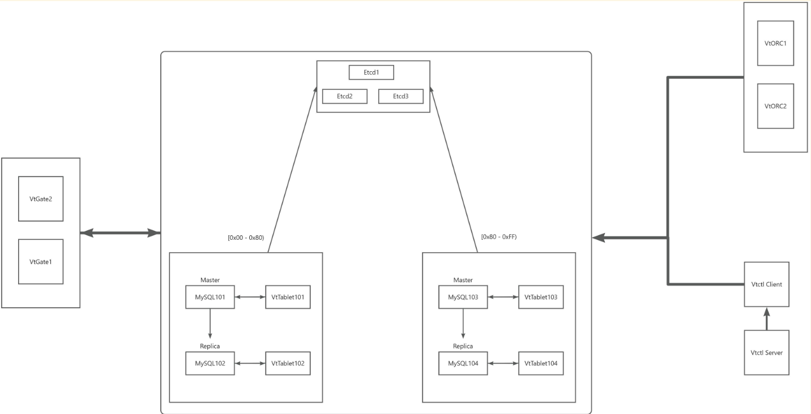

# 架构图


步骤

1. 启动部分组件 

> 初始的vtable强制为replica，防止因启动顺序的不一致触发主从切换
>

```shell
docker-compose up -d etcd1 etcd2 etcd3 vtctld vtctldc
```

2. 通过vtctldc并连接vtctld初始化

> + `--server`：用于指定 vtctld 服务器的地址。
> + `--root`：定义了在 etcd 中注册时使用的根路径。
> + `--server-address`：指向 etcd 集群的服务地址。
> + `--topo-implementation`：指定了所采用的 etcd 实现版本。
> + `zone1`：代表一个逻辑分区。
>

```shell
 docker exec -it vitess-compose-vtctldc-1 /bin/vtctldclient --server=vtctld:15000 AddCellInfo --root="/vitess/zone1" --server-address="etcd1:2379,etcd2:2379,etcd3:2379" --topo-implementation="etcd2" zone1
```

3. 启动剩余组件

```shell
 docker-compose up -d
```

4. 清除MySQL从库GTID

> MySQL启动脚本会产生日志
>
> 提升主库时主从GTID不一致
>
> <font style="color:#DF2A3F;">所以要清空从库GTID日志</font>
>

```shell
mysql -uroot -p
RESET MASTER;
```

5. 升级101、103为主库

```shell
docker exec -it vitess-compose-vtctldc-1 vtctldclient --server vtctld:15000 PlannedReparentShard ks1/80- --new-primary zone1-101
```

```shell
docker exec -it vitess-compose-vtctldc-1 vtctldclient --server vtctld:15000 PlannedReparentShard ks1/80- --new-primary zone1-103
```

命令说明

| 部分 | 含义 |
| --- | --- |
| `vtctldclient` | Vitess 提供的命令行客户端，用于与 `vtctld`（控制面服务）通信。 |
| `--server vtctld:15000` | 指定连接的 `vtctld` 服务地址（这里是主机名 `vtctld`，端口 `15000`）。 |
| `InitShardPrimary` | 命令：用于初始化某个 shard 的 primary（主节点）。 |
| `--force` | 强制执行初始化，即使已有 primary，也会替换。一般用于修复或手动初始化场景。 |
| `ks1/-80` | 表示 vtable中参数init_keyspace 和 init_shard 的某个 shard，shard 范围是 `-80` |
| `zone1-101` | 要设为该分片主节点的 tablet 的 alias，格式通常是 `<cell>-<uid>`。即 vtable中指定的tablet-path |


# 验证
进入任意etcd并检查

```shell
etcdctl --endpoints=etcd1:2379,etcd2:2379,etcd3:2379 endpoint health
```

进入vtctldc检查

```shell
 docker exec -it vitess-compose-vtctldc-1 vtctldclient --server vtctld:15000 GetCellInfoNames
```

```shell
 docker exec -it vitess-compose-vtctldc-1 vtctldclient --server vtctld:15000 GetTablets
```

> zone1-0000000101 ks1 -80 primary 61cd0852ce2f:15101 mysql101:3306 [] 2025-05-30T12:01:46Z
>
> zone1-0000000102 ks1 -80 replica 52f810714c6c:15201 mysql102:3306 [] <null>
>
> zone1-0000000103 ks1 80- primary 0aa7f27ff8ad:15301 mysql103:3306 [] 2025-05-30T12:02:52Z
>
> zone1-0000000104 ks1 80- replica b17c601c8c7d:15401 mysql104:3306 [] <null>
>